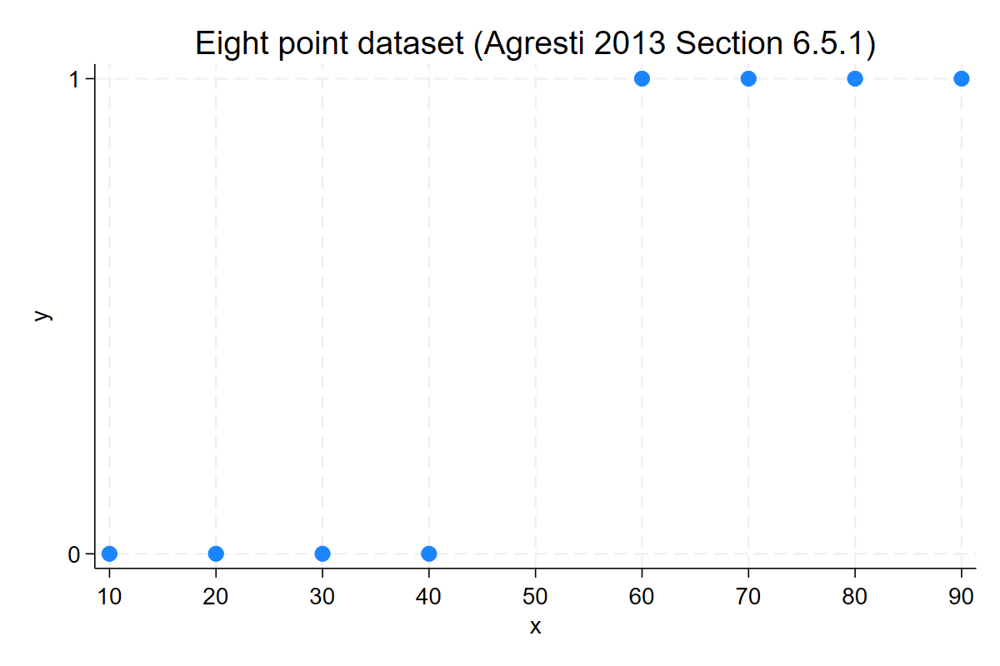
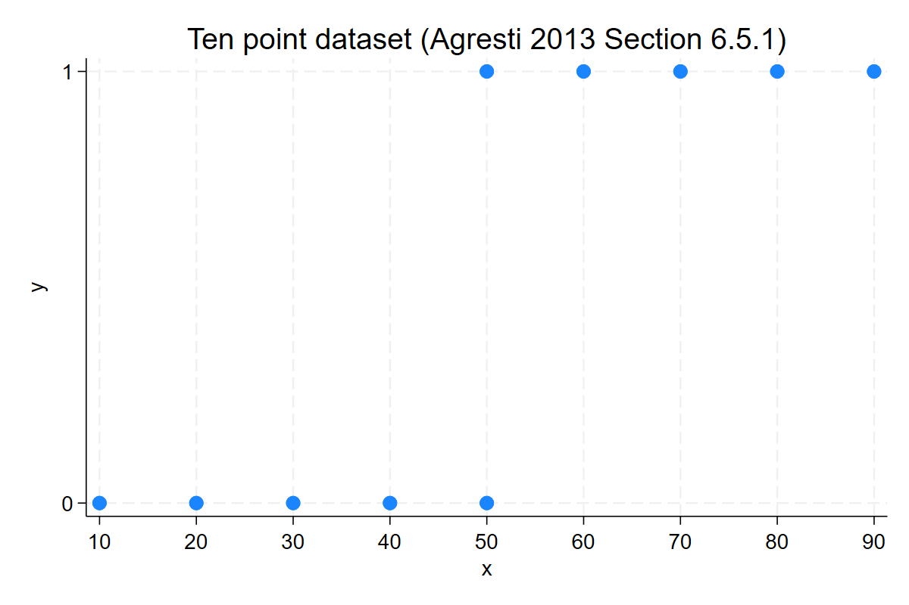
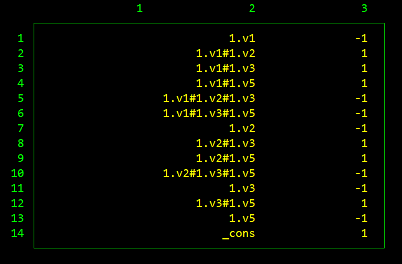

# Examples of nonexistence of estimates for Poisson, Logit, and Multinomial Logit models

- About `ppmlhdfe`: [Github Readme](https://github.com/sergiocorreia/ppmlhdfe/tree/master?tab=readme-ov-file#ppmlhdfe-poisson-pseudo-likelihood-regression-with-multiple-levels-of-fixed-effects) | [Working Paper](https://arxiv.org/abs/1903.01690) | [Stata Journal](https://doi.org/10.1177/1536867X20909691) | [Help File](http://scorreia.com/help/ppmlhdfe.html) | [Undocumented Options](https://github.com/sergiocorreia/ppmlhdfe/blob/master/guides/undocumented.md)
- About Nonexistence: [Working Paper](https://arxiv.org/abs/1903.01633) | [Primer](https://github.com/sergiocorreia/ppmlhdfe/blob/master/guides/nonexistence_primer.md) | [Examples](https://github.com/sergiocorreia/ppmlhdfe/blob/master/guides/nonexistence_examples.md) | [Software Benchmarks](https://github.com/sergiocorreia/ppmlhdfe/blob/master/guides/nonexistence_benchmarks.md)
- Sections: [Logit](#logit--logistic) | [Multinomial Logit](#multinomial-logit) | [Poisson](#poisson) | [Seventeen Examples](#seventeen-poisson-examples) | [References](#references)

*(These examples complement [Verifying the existence of maximum likelihood estimates for generalized linear models](https://arxiv.org/abs/1903.01633); please see the links above for related guides.)*

This section discusses several canonical examples of separation from existing literature, and introduces a suite of 17 examples of nonexistence for Poisson models, which can be used to test software implementation of existing separation algorithms as well as to benchmark the performance of future algorithms. The [Stata replication code](https://github.com/sergiocorreia/ppmlhdfe/tree/master/guides/code) as well as the [input data](https://github.com/sergiocorreia/ppmlhdfe/tree/master/guides/input) are available as well.


## Logit / Logistic


### Agresti's Eight-Point Example

<!-- 
* Source: Categorical Data Analysis 3E (Agresti 2012) - Figure 6.5 - Section 6.5.1 - Page 234
* Suggested by R1 :)
 -->

This example from section 6.5.1 of "Categorical Data Analysis" (Agresti 2012) shows a simple case of complete separation in a logit model, where the two regressors (X and the constant) are able to perfectly separate the positive values of y from its zero values, perfectly predicting all observed outcomes (see also [Geyer 2025](https://www.stat.umn.edu/geyer/5421/notes/infinity.html#complete-separation-example-of-agresti) for additional insights on this example and how to conduct inference with it).

<p align="center"></p>

To estimate this using `ppmlhdfe`, we must first apply the Multinomial-Poisson equivalency, specialized for the Logit case (see the `Multinomial Logit` section for references including a Stata implementation).

Here, our algorithm flags all eight observations as perfectly predicted and drops them, in the same way as Stata's built-in `logit` command does:

```stata
. logit y x
outcome = x > 40 predicts data perfectly

. reshape_logit y x // user developed ado-file; located in the /code folder
. ppmlhdfe y x c, absorb(i) vce(cluster i) // insufficient obs after dropping the 8
(ReLU method dropped 8 separated observations in 1 iterations)

Insufficient observations after dropping separated obs.
To view the "direction of recession" (Geyer 2009), type e.g.:
. ppmlhdfe ..., absorb(...) tagsep(sep) zvar(z) r2
```

We can then follow the suggested command in order to inspect the directions of recession:

```stata
. ppmlhdfe y x c, absorb(i) vce(cluster i) tagsep(sep) zvar(z) r2
<some output omitted...>

Verifying certificate of separation:
. reghdfe z x c, absorb(i)
(MWFE estimator converged in 1 iterations)

HDFE Linear regression                            Number of obs   =         16
Absorbing 1 HDFE group                            F(   2,      6) =   6.76e+16
                                                  Prob > F        =     0.0000
                                                  R-squared       =     1.0000
                                                  Adj R-squared   =     1.0000
                                                  Within R-sq.    =     1.0000
                                                  Root MSE        =     0.0000

------------------------------------------------------------------------------
           z | Coefficient  Std. err.      t    P>|t|     [95% conf. interval]
-------------+----------------------------------------------------------------
           x |      -.025   6.80e-11 -3.7e+08   0.000        -.025       -.025
           c |       1.25   3.88e-09  3.2e+08   0.000         1.25        1.25
       _cons |   .3125001   1.32e-09  2.4e+08   0.000     .3125001    .3125001
```

Here we can observe the two directions of recession, and thus `{βx, βc} = lim (a -> ∞) {-0.25 a, 1.25 a}`. In the accompanying [Stata code](code/1-agresti-eight-points.do) we also discuss how to perform inference on these estimates, as even though point estimates do not exist, P-Values can still be recovered (and so can confidence intervals, as pointed by Agresti 2012 and Geyer 2025).


### Agresti's Ten-Point Example


This is a very similar example, where we arrive at quasi-complete separation rather than complete separation, as two points have been added on `x=50`, one with `y=0` and the other with `y=1`.
As before, `ppmlhdfe` can also identify all separated observations and recover the directions of recession. See the [Stata code](code/2-agresti-ten-points.do) for more details.

<p align="center"></p> 


### Endometrial Cancer Example

This example is from page 186 section 5.7.1 of "Foundations of Linear and Generalized Linear Models" (Agresti 2015), but is also discussed in Heinze and Schemper (2002) and Agresti (2012). [Kosmidis and Schumacher (2021)](https://cran.r-project.org/web/packages/detectseparation/vignettes/separation.html) also discuss this in a vignette on their `detectseparation` R package, implemented via the Simplex method.

<!-- The endometrial data set was first analyzed in Heinze and Schemper (2002), and was originally provided by Dr E. Asseryanis from the Medical University of Vienna. -->

The outcome variable is the histology grade of a tumor (low=0, 1=high) and there are three regressors. `x1` is an indicator variable ("neovasculization with coding 0 for absent and 1 for present"), `x2` is a positive integer ("pulsality index of arteria uterina"), and `x3` is a positive real ("endometrium height").

A Logit regression on this data exhibits quasi-complete separation, as all cases of `y=1` occur when `x1=1` (so x1 perfectly predicts a high histology grade in the sample, but when `x=0` there are obs. both with and without cancer).

Stata's `logit` estimate detects this and excludes the 13 obs where `x1=1`:

```stata
. tab y x1

           |          x1
         y |         0          1 |     Total
-----------+----------------------+----------
         0 |        49          0 |        49 
         1 |        17         13 |        30 
-----------+----------------------+----------
     Total |        66         13 |        79 

. logit y x1 x2 x3

note: x1 != 0 predicts success perfectly;
      x1 omitted and 13 obs not used.

Iteration 0:  Log likelihood = -37.653392  
<some output omitted...>

Logistic regression                                     Number of obs =     66
                                                        LR chi2(2)    =  19.91
                                                        Prob > chi2   = 0.0000
Log likelihood = -27.69663                              Pseudo R2     = 0.2644

------------------------------------------------------------------------------
           y | Coefficient  Std. err.      z    P>|z|     [95% conf. interval]
-------------+----------------------------------------------------------------
          x1 |          0  (omitted)
          x2 |  -.0421834    .044332    -0.95   0.341    -.1290725    .0447057
          x3 |  -2.902606   .8455516    -3.43   0.001    -4.559856   -1.245355
       _cons |   4.304518   1.637299     2.63   0.009     1.095471    7.513564
------------------------------------------------------------------------------
```

After applying the Logit-Poisson equivalence, `ppmlhdfe` outputs the same point estimates:

<!-- .     ppmlhdfe y x* c, absorb(i) vce(cluster i) // sep(relu) relu_maxiter(200) // uncomment this to only use ReLu method -->

```stata
.     ppmlhdfe y x* c, absorb(i) vce(cluster i)
(simplex method dropped 13 separated observations)
note: 1 variable omitted because of collinearity: x1
<some output omitted...>

HDFE PPML regression                              No. of obs      =        132
Absorbing 1 HDFE group                            Residual df     =         65
Statistics robust to heteroskedasticity           Wald chi2(3)    =      10.59
Deviance             =  55.39326036               Prob > chi2     =     0.0141
Log pseudolikelihood = -93.69663018               Pseudo R2       =     0.1615

Number of clusters (i)      =         66
                                     (Std. err. adjusted for 66 clusters in i)
------------------------------------------------------------------------------
             |               Robust
           y | Coefficient  std. err.      z    P>|z|     [95% conf. interval]
-------------+----------------------------------------------------------------
          x1 |          0  (omitted)
          x2 |  -.0421834   .0720096    -0.59   0.558    -.1833196    .0989528
          x3 |  -2.902606   1.044777    -2.78   0.005    -4.950331   -.8548803
           c |   4.304518   2.175852     1.98   0.048     .0399261    8.569109
<some output omitted...>
```

Similarly, as shown in the [Stata code](./code/3-endometrial.do.do), we can find the directions of recession of x (`βx = lim (a -> ∞) {-1 a}`).


## Multinomial Logit

To solve the Multinomial Logit model, we take advantage of the Multinomial-Poisson equivalence, also known as the Multinomial-Poisson "trick" (see [Palmgreen 1981](https://www.jstor.org/stable/2335606), [Baker 1994](https://www.jstor.org/stable/2348134), [Guimarães 2004](https://journals.sagepub.com/doi/abs/10.1177/1536867X0400400304), amongst others).


### Alligators ([Stata do-file](./code/example-aligators.do))

This example on the food of choice of alligators comes from Agresti (2002, Table 7.4). The regression discussed by Agresti has finite estimates, but [Kosmidis (2017)](https://cran.r-project.org/web/packages/brglm2/vignettes/multinomial.html) shows how a simple sparsification of the dataset, achieved by updating the frequency weight to 1/3 of their original values, leads to infinite estimates.

In particular:

```stata
. replace freq = round(freq/3)
(39 real changes made)

. mlogit foodchoice ib2.size ib4.lake [fw=freq], tol(1e-12) nolog

Multinomial logistic regression                         Number of obs =     69
                                                        LR chi2(16)   =  25.49
                                                        Prob > chi2   = 0.0616
Log likelihood = -80.956515                             Pseudo R2     = 0.1360

------------------------------------------------------------------------------
  foodchoice | Coefficient  Std. err.      z    P>|z|     [95% conf. interval]
-------------+----------------------------------------------------------------
Fish         |  (base outcome)
-------------+----------------------------------------------------------------
// omitted
-------------+----------------------------------------------------------------
Reptile      |
        size |
      <=2.3  |  -1.056638    1.28096    -0.82   0.409    -3.567274    1.453998
             |
        lake |
    Hancock  |   15.60054   2003.427     0.01   0.994    -3911.043    3942.245
   Oklawaha  |   16.29274   2003.427     0.01   0.994    -3910.351    3942.937
   Trafford  |   16.42811   2003.427     0.01   0.993    -3910.216    3943.072
             |
// omitted
```

As we can see here, the Reptile category as infinite estimates for the coefficients of each lake (values of 15-16 approach infinity once exponentiated).

To estimate it with our algorithm we will first note there are five possible categories for the outcome variable, and then apply the Multinomial-Poisson transform.

```stata
gen obs = _n // Record original obs.
expand 5 // Transform the dataset to long (make five copies as dependent variable has five outcomes)
bys obs: gen byte category = _n // Record each of the five categories
bys obs: gen byte y = foodchoice==category // New outcome variable
```

Then, we can apply our algorithm while clustering for the original observations:

```stata
. ppmlhdfe y ib1.category##(ib2.size ib4.lake) [fw=freq], a(obs) nocons sep(relu)
note: 4 variables omitted because of collinearity: 1bn.size 1bn.lake 2bn.lake 3bn.lake
(ReLU method dropped 17 separated observations in 92 iterations)
note: 2 variables omitted because of collinearity: 3.category#3.lake 4.category#2.lake
Iteration 1:   deviance = 1.9461e+02  eps = .         iters = 1    tol = 1.0e-04  min(eta) =  -3.31  P   
// omitted
Converged in 6 iterations and 6 HDFE sub-iterations (tol = 1.0e-08)


HDFE PPML regression                              No. of obs      =        170
Absorbing 1 HDFE group                            Residual df     =        136
                                                  Wald chi2(12)   =      21.79
Deviance             =  89.23908325               Prob > chi2     =     0.0399
Log pseudolikelihood = -78.61954162               Pseudo R2       =     0.1139
----------------------------------------------------------------------------------------
                       |               Robust
                     y | Coefficient  std. err.      z    P>|z|     [95% conf. interval]
-----------------------+----------------------------------------------------------------
// omitted
         category#lake |
 Invertebrate#Hancock  |  -2.601252   1.150367    -2.26   0.024     -4.85593   -.3465742
      Reptile#Hancock  |  -.8821981   1.017438    -0.87   0.386     -2.87634    1.111944
         Bird#Hancock  |   .7881922   1.262154     0.62   0.532    -1.685585    3.261969
        Other#Hancock  |   .2364445   .9539814     0.25   0.804    -1.633325    2.106214
// omitted
```

From this output, we can see three things:

1. The ReLu method dropped 17 observations as they were perfectly separated.
2. After dropping these observations, three variables with infinite estimates are now omitted due to collinearity
3. Other estimates, which did not have infinite estimates and were previously reported incorrect values, now report the correct estimates (the same values one would obtain had the software package been able to correctly estimate the respective infinite coefficients).


## Poisson

### Geyer's contingency table example

Section 2.3 of Geyer (2009) shows a Poisson regression based on a contingency table. In this example, several coefficients don't have finite solutions. These coefficients are listed on Table 1 of the book, which shows the "general direction of recession" (GDOR) of each coefficient; i.e how is it approximating +/- infinity in relation with the other infinite estimates.

The `ppmlhdfe` code below replicates this table:


```stata
import delimited using "http://www.stat.umn.edu/geyer/gdor/catrec.txt", delim(" ") clear
ppmlhdfe y i.(v*)#i.(v*)#i.(v*) , tagsep(sep) zvar(z) r2 // Get certificate of separation Z, and regress it against the Xs
* Code below is just to present a prettier output:
matrix b = e(b)
mata: vars = st_matrixcolstripe("b")
mata: directions = round(st_matrix("b"), 0.001)'
mata: idx = selectindex(directions)
mata: (vars, strofreal(directions))[idx, .]
```

<p align="center"></p>

As we can see, we are able to recover Geyer's "direction of recession" by employing the IR algorithm, which has the added advantage of being easy to implement, and not requiring exact algebra routines.


## Seventeen Poisson Examples

Throughout our work developing `ppmlhdfe`, we have come across several datasets exhibiting nonexistence issues with Poisson regressions. Some of these datasets were compiled from our own work on other research papers, others were submitted by users of earlier versions of the package who were experiencing convergence issues, and a few were manually designed to test some corner cases that might trip common separation detection algorithms.

We have now compiled a suite of seventeen of these datasets, which we hope can be useful for future researchers that want to test their algorithms or software with datasets were nonexistence occurs.

To ease the burden of any users, we have standardized these datasets in the following way:

1. All seventeen cases are stored as CSV files with a header indicating the variable names.
1. In all cases, `y` represents the outcome variable; the variables starting with `x` represent the regressors; and any variables starting with `id` correspond to categorical variables representing fixed effects.
1. The indicator `separated` equals 1 for separated observations.
1. Lastly, some datasets were fairly large, although separation was only caused by a small fraction of the total observations. We have trimmed the observations on these data to speed up estimation and reduce any bandwidth costs.

For instance, let's look at the first example dataset, [`01.csv`](separation_datasets/01.csv), which is based on country export-import data:

```csv
y,x1,x2,id1,id2,separated
0.0000000000,-0.9303550124,1,1,4,1
0.0000000000,0.1835959703,1,2,1,1
0.0000000000,-0.6371972561,0,2,6,0
0.0000000000,-0.4237562418,0,2,7,0
0.1527670026,-1.1799178123,0,8,4,0
0.1553160399,0.8860545158,0,1,7,0
0.1734523475,1.0502026081,0,8,3,0
0.2217264324,-0.2490162849,0,9,1,0
0.2260344625,0.9635434151,0,7,6,0
<90 rows omitted>
```

This dataset contains two regressors plus two sets of fixed effects, and can be estimated in Stata as follows:

```stata
. import delimited "../separation_datasets/01.csv"

. ppmlhdfe y x*, a(id1 id2) sep(relu)
(ReLU method dropped 2 separated observations in 1 iterations)
note: 1 variable omitted because of collinearity: x2
<some output omitted...>

HDFE PPML regression                              No. of obs      =         98
Absorbing 2 HDFE groups                           Residual df     =         78
                                                  Wald chi2(1)    =       0.71
Deviance             =  103.8370321               Prob > chi2     =     0.3994
Log pseudolikelihood = -156.9550378               Pseudo R2       =     0.0863
------------------------------------------------------------------------------
             |               Robust
           y | Coefficient  std. err.      z    P>|z|     [95% conf. interval]
-------------+----------------------------------------------------------------
          x1 |   .0860266   .1020919     0.84   0.399    -.1140698     .286123
          x2 |          0  (omitted)
       _cons |   .6224762   .0866869     7.18   0.000     .4525731    .7923794
------------------------------------------------------------------------------

Absorbed degrees of freedom:
-----------------------------------------------------+
 Absorbed FE | Categories  - Redundant  = Num. Coefs |
-------------+---------------------------------------|
         id1 |        10           0          10     |
         id2 |        10           1           9     |
-----------------------------------------------------+

. ppmlhdfe y x*, a(id1 id2) sep(relu) tagsep(sep_relu) r2 zvar(z) 
<some output omitted...>
HDFE Linear regression                            Number of obs   =        100
Absorbing 2 HDFE groups                           F(   2,     79) =          .
                                                  Prob > F        =          .
                                                  R-squared       =     1.0000
                                                  Adj R-squared   =     1.0000
                                                  Within R-sq.    =     1.0000
                                                  Root MSE        =     0.0000

------------------------------------------------------------------------------
           z | Coefficient  Std. err.      t    P>|t|     [95% conf. interval]
-------------+----------------------------------------------------------------
          x1 |   3.25e-11   4.20e-11     0.77   0.442    -5.11e-11    1.16e-10
          x2 |          1   2.88e-10  3.5e+09   0.000            1           1
       _cons |  -9.37e-13   3.72e-11    -0.03   0.980    -7.49e-11    7.30e-11
<some output omitted...>
```

As we can see, `ppmlhdfe` drops two observations as well as the variable `x2`. After obtaining the certificate of separation (with the `zvar()` option), we regress this `z` variable against the regresors and observe that all coefficients have estimates of zero except for `x2` with an estimate of 1. This indicates that `b_{x2} -> +∞` as it perfectly predicts two observations where `y=0`, without affecting the estimates of any other variables.

If you are a Stata user, you can run the script [`6-cgz-poisson-benchmarks.do`](code/6-cgz-poisson-benchmarks.do) in order to run all seventeen tests. Alternatively, it should be feasible to construct an equivalent for-loop in any statistical programming language.

## References

- Palmgren (1981). "Models for the analysis of contingency tables with quantitative outcome variables". Biometrika, 68(3):563–576. https://www.jstor.org/stable/2335606
- Baker (1994). "The Multinomial-Poisson Transformation". Journal of the Royal Statistical Society: Series D (The Statistician), 43(4):495–504. https://www.jstor.org/stable/2348134
- Guimarães (2004). "Understanding the Multinomial-Poisson Transformation". Stata Journal, 4(3):290–299. https://doi.org/10.1177/1536867X0400400304
- Correia, Guimarães, and Zylkin (2020). "Fast Poisson estimation with high-dimensional fixed effects". Stata Journal, 20(1):95–115. https://doi.org/10.1177/1536867X20909691
- Correia, Guimarães, and Zylkin (2019). "Verifying the existence of maximum likelihood estimates for generalized linear models". arXiv Working Paper: https://arxiv.org/abs/1903.01633
- Kosmidis and Schumacher (2021). "`detectseparation`: Detect and Check for Separation and Infinite Maximum Likelihood Estimates". https://cran.r-project.org/web/packages/detectseparation/
- Kosmidis (2017). "`brglm2`: Bias Reduction in Multinomial Models". https://cran.r-project.org/web/packages/brglm2/vignettes/multinomial.html
- Geyer (2009). "Likelihood Inference in Exponential Families and Directions of Recession." University of Minnesota, School of Statistics. http://www.stat.umn.edu/geyer/5421/notes/infinity.pdf
- Geyer (2025). Course notes. https://www.stat.umn.edu/geyer/5421/notes/infinity.html#complete-separation-example-of-agresti
- Agresti (2012). "Categorical Data Analysis", 3rd Edition. Wiley.
- Agresti (2015). "Foundations of Linear and Generalized Linear Models." Wiley.
- Heinze and Schemper (2002). "A solution to the problem of separation in logistic regression". Statistics in Medicine, 21(16):2409–2419.
