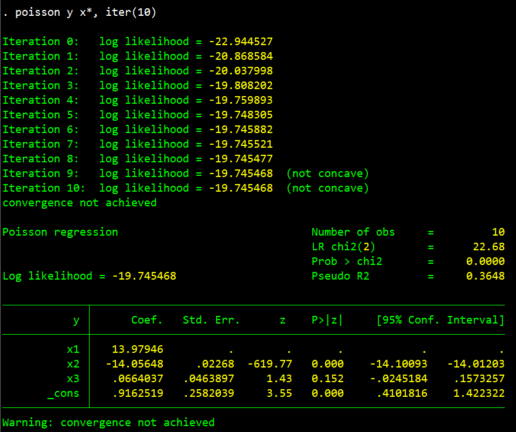
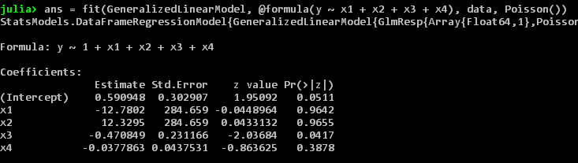
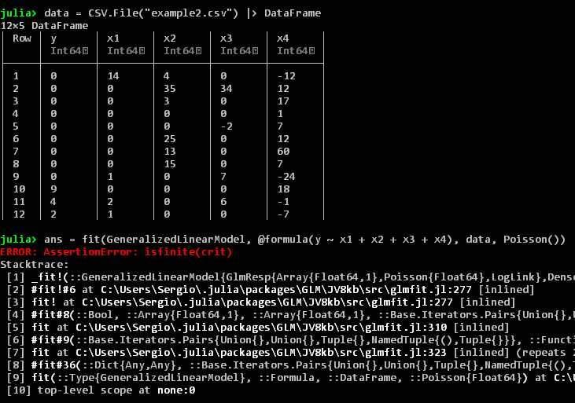
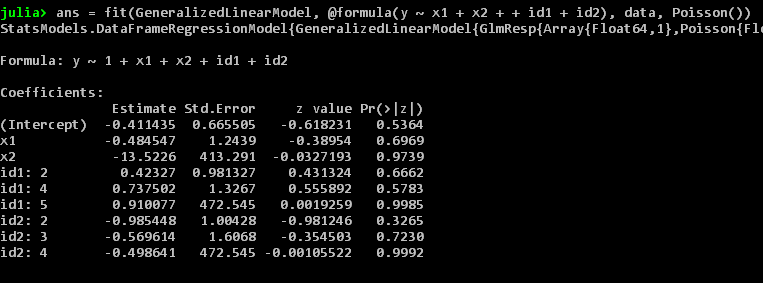
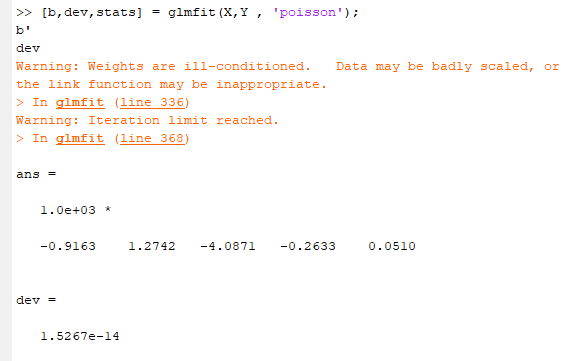
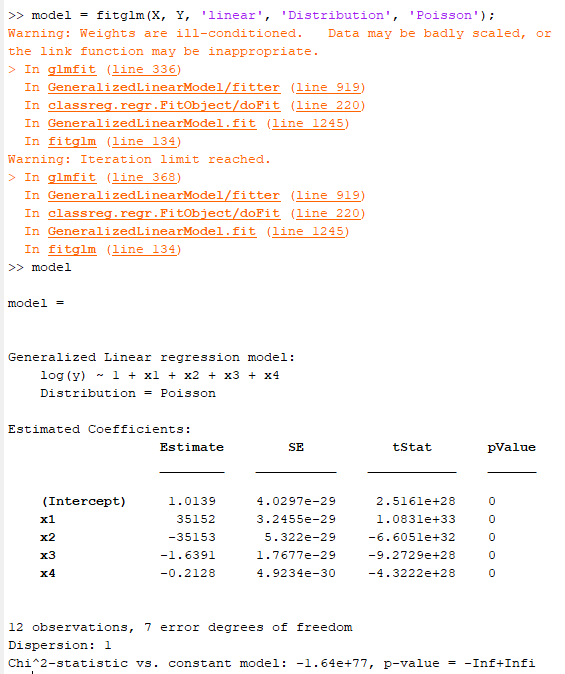
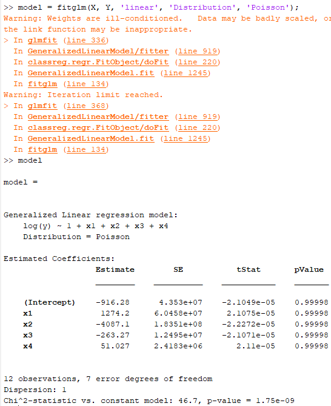

# Statistical separation in Poisson models across different statistical packages

- Jump to: [Readme](https://github.com/sergiocorreia/ppmlhdfe/blob/master/Readme.md) | [`ppmlhdfe` Paper](http://scorreia.com/research/ppmlhdfe.pdf) | [Separation Paper](http://scorreia.com/research/separation.pdf) | [Help File](http://scorreia.com/help/ppmlhdfe.html) | [Separation Primer](https://github.com/sergiocorreia/ppmlhdfe/blob/master/guides/separation_primer.md) | [Separation Benchmarks](https://github.com/sergiocorreia/ppmlhdfe/blob/master/guides/separation_benchmarks.md) | [Undocumented Options](https://github.com/sergiocorreia/ppmlhdfe/blob/master/guides/undocumented.md)
- Sections: [Stata](#stata-packages) | [R](#r-packages) | [Julia](#julia-v110) | [Matlab](#matlab) | [Extra](#additional-packages-not-tested)

To the best of our knowledge, no existing statistical software addresses the separation problem in a robust way, more so when working with fixed effects. In this post, we study a few simple examples of separation, and how they affect some of the most popular statistical packages.

We also include [18 example datasets](https://github.com/sergiocorreia/ppmlhdfe/tree/master/test/separation_datasets) that can be used for package developers to test for correctness of their programs, and invite further additions to this list.

Note that this is in no way a critique of the packages discussed below, which are in our opinion of excellent quality.
Merely, we are using them to show the fact that separation is not only a [theoretical](http://scorreia.com/research/separation.pdf) problem, but a practical one.

Also, although we focus here on Poisson models, separation is an issue for most generalized linear models (although it is a better understood problem in [binary response models](https://stats.idre.ucla.edu/other/mult-pkg/faq/general/faqwhat-is-complete-or-quasi-complete-separation-in-logisticprobit-regression-and-how-do-we-deal-with-them/
)).


## Stata packages

### Lack of convergence

The table below shows a dataset with 10 observations and three regressors. Observations 1 and 5 are separated because `y=0` and `z = x2 - x1` is positive in those observations, and zero otherwise.

| y  | x1  | x2  | x3 |
|----|-----|-----|----|
| 0  | 0   | 1   | 0  |
| 0  | 0   | 0   | 0  |
| 0  | 0   | 0   | 0  |
| 0  | 0   | 0   | 0  |
| 0  | 1   | 9   | 0  |
| 2  | 21  | 21  | 21 |
| 3  | 0   | 0   | 0  |
| 5  | 0   | 0   | 0  |
| 7  | 0   | 0   | 0  |
| 10 | -18 | -18 | 0  |

Let's try to run a Poisson regression on this dataset, exploring the following alternatives:

1. The built-in `poisson` command
2. The `glm` command with `poisson` family, using maximum likelihood optimization. `glm` is more modern than the `poisson` command, and often works if the former has convergence issues.
3. The `glm` command with `poisson` family, estimated via iteratively reweighted least squares (IRLS).
4. The [`ppml`](https://ideas.repec.org/c/boc/bocode/s458102.html) command, by Silvana Tenreyro and João Santos Silva. `ppml` uses `glm`internally, but first performs a few checks to identify separated observations and the regressors causing them (see also their [Economic Letters](https://doi.org/10.1016/j.econlet.2010.02.020) article):
	- It first checks if there are collinear regressors on the sample where `y>0`. If there are none, there is no separation
	- Otherwise, it will only keep a regressor `x` if the following overlap condition applies: `min(x | y=0) ≤ mean(x | y>0) ≤ max(x | y=0)`. Note that because the overlap condition is not the second condition for separation, in some cases separated observations are not  detected, and in other cases non-separated observations are flagged as separated.
5. The `ppml` command, with the `strict` option

```stata
clear
input int(y x1 x2 x3)
 0   0   1  0
 0   0   0  0
 0   0   0  0
 0   0   0  0
 0   1   9  0
 2  21  21 21
 3   0   0  0
 5   0   0  0
 7   0   0  0
10 -18 -18  0
end


poisson y x*, iter(1000) // does not converge, but deviance and LL are close to correct values (see figure)
glm y x*, family(poisson) ml iter(1000) // does not converge, but deviance and LL are close to correct values
glm y x*, family(poisson) irls iter(1000) // does not converge, but deviance and LL are close to correct values
ppml y x* // does not converge, but deviance and LL are close to correct values
ppml y x*, strict // converges to incorrect solution; with b[x3] = 0.961 and deviance and log-likelihoods far from the correct values
ppmlhdfe y x*, sep(none) maxiter(100) // If we disable separation checks, ppmlhdfe will also fail to converge

ppmlhdfe y x* // only command that converges to correct estimate; b[x3] = 0.066
```

As we can see if we run the code snippet, all of the standard packages either fail to converge, or converge to an incorrect result. For instance, this is the output after the first ten iterations of the `poisson` command:

<p align="center"></p>

### Convergence to incorrect output

The examples above mostly showed cases where the commands ran forever and failed to converge. However, more problematic than a failure to converge -- which gives no output -- is convergence to an incorrect result, where the user might not even be aware of the misleading estimates. The example below shows one such case, in a setup very similar to the one above:

| y | x1 | x2 | x3 | x4 |
|---|----|----|----|----|
| 0 | 0  | 0  | 2  | 10 |
| 0 | 0  | 0  | 0  | -2 |
| 0 | 0  | 0  | 0  | 6  |
| 0 | 0  | 0  | 4  | 5  |
| 0 | 1  | 0  | 0  | 3  |
| 2 | 0  | 0  | 0  | 3  |
| 2 | 0  | 0  | 0  | 4  |
| 2 | 0  | 0  | -2 | 15 |
| 2 | 0  | 0  | 0  | -7 |
| 4 | 0  | 0  | -3 | 15 |
| 6 | -3 | -3 | 0  | 4  |
| 6 | 0  | 0  | 0  | 4  |

Here, the fifth observation is separated by the linear combination `z = x1 - x2`.

```stata
loc url "https://raw.githubusercontent.com/sergiocorreia/ppmlhdfe/master/guides/csv"
insheet using "`url'/example1.csv", clear

ppmlhdfe y x*
poisson y x*, iter(100) nolog
cap noi glm y x*, family(poisson) ml iter(100) nolog
cap noi glm y x*, family(poisson) irls iter(100) nolog
ppml y x*
ppml y x*, strict
```

Because a linear combination of x1 and x2 is causing the separation, after we remove the separated observation x1 and x2 will be equal. Thus, one of these two variables will be dropped due to collinearity. In the case of ppmlhdfe, it dropped x2:

<p align="center"></p>

Note, however, that all other methods report differing results:

- `poisson` and `glm` report an arbitrarily low number for b1 and a high number for b2. For instance `b1=-15.18` with `poisson`, -16.35 with `glm,ml`, and -16.47 for `glm,irls`.
- The estimates for the regressors *not* involved in the separation are also different across packages:

| Method             | \_b[\_cons] | Numerical Error |
|--------------------|-----------|-----------------|
| ppmlhdfe (correct) | 0.59095   |                 |
| poisson            | 0.59105   | -1.0E-04        |
| glm, ml            | 0.59086   | 8.5E-05         |
| glm, irls          | 0.59095   | -3.7E-14        |
| ppml               | 0.49919   | 9.2E-02         |
| ppml, strict       | 0.49919   | 9.2E-02         |

The difference here is not extremely high, but a priori it is impossible to know how large will be the error introduced by the statistical package.


## R Packages

### GLM

We first test the standard `glm` package, widely used:

| y | x1 | x2 | x3 | x4  |
|---|----|----|----|-----|
| 0 | 14 | 4  | 0  | -12 |
| 0 | 0  | 35 | 34 | 12  |
| 0 | 0  | 3  | 0  | 17  |
| 0 | 0  | 0  | 0  | 1   |
| 0 | 0  | 0  | -2 | 7   |
| 0 | 0  | 25 | 0  | 12  |
| 0 | 0  | 13 | 0  | 60  |
| 0 | 0  | 15 | 0  | 7   |
| 0 | 1  | 0  | 7  | -24 |
| 9 | 0  | 0  | 0  | 18  |
| 4 | 2  | 0  | 6  | -1  |
| 2 | 1  | 0  | 0  | -7  |

```R
>         data <- read.csv(file="example2.csv", header=TRUE, sep=",")
>         formula <- y ~ x1 + x2 + x3 + x4
>         mod <- glm(formula, data, family=poisson())
Warning messages:
1: glm.fit: algorithm did not converge 
2: glm.fit: fitted rates numerically 0 occurred 
>         summary(mod)

Call:
glm(formula = formula, family = poisson(), data = data)

Deviance Residuals: 
       Min          1Q      Median          3Q         Max  
-3.109e-03  -2.000e-08  -2.000e-08  -2.000e-08   2.000e-08  

Coefficients:
            Estimate Std. Error z value Pr(>|z|)
(Intercept)  -367.83    7448.51  -0.049    0.961
x1            512.42   10345.15   0.050    0.960
x2          -1644.86   33284.96  -0.049    0.961
x3           -105.85    2138.00  -0.050    0.961
x4             20.56     413.81   0.050    0.960

(Dispersion parameter for poisson family taken to be 1)

    Null deviance: 4.6719e+01  on 11  degrees of freedom
Residual deviance: 9.6716e-06  on  7  degrees of freedom
AIC: 19.933

Number of Fisher Scoring iterations: 25
```

As expected, the results don't converge, but at least `glm` gives us a warning that there were some perfect fits at zero. Note however that these warnings are not always given:

| y | x1 | x2 | x3 | x4 |
|---|----|----|----|----|
| 0 | 0  | 0  | 2  | 10 |
| 0 | 0  | 0  | 0  | -2 |
| 0 | 0  | 0  | 0  | 6  |
| 0 | 0  | 0  | 4  | 5  |
| 0 | 1  | 0  | 0  | 3  |
| 2 | 0  | 0  | 0  | 3  |
| 2 | 0  | 0  | 0  | 4  |
| 2 | 0  | 0  | -2 | 15 |
| 2 | 0  | 0  | 0  | -7 |
| 4 | 0  | 0  | -3 | 15 |
| 6 | -3 | -3 | 0  | 4  |
| 6 | 0  | 0  | 0  | 4  |

```R
>         data <- read.csv(file="example1.csv", header=TRUE, sep=",")
>         formula <- y ~ x1 + x2 + x3 + x4
>         mod <- glm(formula, data, family=poisson())
>         summary(mod)

Call:
glm(formula = formula, family = poisson(), data = data)

Deviance Residuals: 
     Min        1Q    Median        3Q       Max  
-1.97355  -0.75131  -0.16879   0.07357   2.70708  

Coefficients:
              Estimate Std. Error z value Pr(>|z|)  
(Intercept)    0.59095    0.30291   1.951   0.0511 .
x1           -17.78017 3467.85854  -0.005   0.9959  
x2            17.32952 3467.85856   0.005   0.9960  
x3            -0.47085    0.23117  -2.037   0.0417 *
x4            -0.03779    0.04375  -0.864   0.3878  
---
Signif. codes:  0 ?***? 0.001 ?**? 0.01 ?*? 0.05 ?.? 0.1 ? ? 1

(Dispersion parameter for poisson family taken to be 1)

    Null deviance: 31.912  on 11  degrees of freedom
Residual deviance: 15.956  on  7  degrees of freedom
AIC: 46.991

Number of Fisher Scoring iterations: 15
```

Here `x1 - x2` equals 1 on the 5th observation and zero otherwise. This explains why x1 and x2 have very high negative and positive values, respectively. However, unlike the previous case, no warning is given.


### GLM2

An alternative to `glm` is the [`glm2`](https://cran.r-project.org/web/packages/glm2/index.html) package by Ian Marschner and Mark W. Donoghoe. As described [here](https://journal.r-project.org/archive/2011-2/RJournal_2011-2_Marschner.pdf), it is aimed at models where `glm` has difficulty converging, such as GLMs with `family=poisson` and `link=identity` (instead of the more common `link=log`, which corresponds to a poisson regression). It works by applying step-halving on the iteratively reweighted least squares (IRLS) part in cases if the iteration seems to be having trouble converging.

Because the innovation done by `glm2` is unrelated to the separation problem, we don't expect `glm2` to perform better than `glm` in examples where separation is present. As shown below, that is indeed the case. In both examples, the output is identical to that of `glm`:

```R
>         data <- read.csv(file="csv/example2.csv", header=TRUE, sep=",")
>         formula <- y ~ x1 + x2 + x3 + x4
>         mod <- glm2(formula, data, family=poisson())
Warning messages:
1: glm.fit2: algorithm did not converge. Try increasing the maximum iterations 
2: glm.fit2: fitted rates numerically 0 occurred 
>         summary(mod)

Call:
glm2(formula = formula, family = poisson(), data = data)

Deviance Residuals: 
       Min          1Q      Median          3Q         Max  
-3.109e-03  -2.000e-08  -2.000e-08  -2.000e-08   2.000e-08  

Coefficients:
            Estimate Std. Error z value Pr(>|z|)
(Intercept)  -367.83    7448.51  -0.049    0.961
x1            512.42   10345.15   0.050    0.960
x2          -1644.86   33284.96  -0.049    0.961
x3           -105.85    2138.00  -0.050    0.961
x4             20.56     413.81   0.050    0.960

(Dispersion parameter for poisson family taken to be 1)

    Null deviance: 4.6719e+01  on 11  degrees of freedom
Residual deviance: 9.6716e-06  on  7  degrees of freedom
AIC: 19.933

Number of Fisher Scoring iterations: 25
```


```R
>         data <- read.csv(file="csv/example1.csv", header=TRUE, sep=",")
>         formula <- y ~ x1 + x2 + x3 + x4
>         mod <- glm2(formula, data, family=poisson())
>         summary(mod)

Call:
glm2(formula = formula, family = poisson(), data = data)

Deviance Residuals: 
     Min        1Q    Median        3Q       Max  
-1.97355  -0.75131  -0.16879   0.07357   2.70708  

Coefficients:
              Estimate Std. Error z value Pr(>|z|)  
(Intercept)    0.59095    0.30291   1.951   0.0511 .
x1           -17.78017 3467.85856  -0.005   0.9959  
x2            17.32952 3467.85857   0.005   0.9960  
x3            -0.47085    0.23117  -2.037   0.0417 *
x4            -0.03779    0.04375  -0.864   0.3878  
---
Signif. codes:  0 ‘***’ 0.001 ‘**’ 0.01 ‘*’ 0.05 ‘.’ 0.1 ‘ ’ 1

(Dispersion parameter for poisson family taken to be 1)

    Null deviance: 31.912  on 11  degrees of freedom
Residual deviance: 15.956  on  7  degrees of freedom
AIC: 46.991

Number of Fisher Scoring iterations: 15
```


### Alpaca

We will now test Amrei Stammann's great `alpaca` package, which allows for fixed effects in Poisson models ([repo](https://github.com/amrei-stammann/alpaca) and [paper](https://arxiv.org/abs/1707.01815); seriously, try it out if you are an R user!).

First, using [fe1.csv](csv/fe1.csv) we can observe that b2=-18.99:

```R
> # install.packages("alpaca")
> data <- read.csv(file="fe1.csv", header=TRUE, sep=",")
> library(alpaca)
> formula <- y ~ x1 + x2 | i + j
> mod <- feglm(formula, data, family=poisson())
> summary(mod)
poisson 

y ~ x1 + x2 | i + j

l= [4, 4], n= 18, deviance= 13.3644

Structural parameter(s):

    Estimate Std. error z value Pr(> |z|)
x1   -0.4845     1.2439  -0.390     0.697
x2  -18.9906  3934.0725  -0.005     0.996
```

However, if we instead run this with `ppmlhdfe`, we would observe that 4 out of the 13 observations are separated, and that the estimates for b2 are not `-18.99`.

```stata
insheet using "csv/fe1.csv", clear
ppmlhdfe y x*, a(i j)
```

Another possible outcome, as we see with [fe2.csv](csv/fe2.csv), is that the package crashes:

```R
> data <- read.csv(file="fe2.csv", header=TRUE, sep=",")
> library(alpaca)
> formula <- y ~ x1 | i + j
> mod <- feglm(formula, data, family=poisson())
Error in feglm(formula, data, family = poisson()) : 
  Backtracking (step-halving) failed.
```

Finally, as shown with [fe3.csv](csv/fe3.csv), in some situations `alpaca` can detect some of the separated observations, although not all of them:

```R
> data <- read.csv(file="fe3.csv", header=TRUE, sep=",")
> library(alpaca)
> formula <- y ~ x1 | i + j
> mod <- feglm(formula, data, family=poisson())
> summary(mod)
poisson 

y ~ x1 | i + j

l= [2, 2], n= 9, deviance= 13.9161

Structural parameter(s):

   Estimate Std. error z value Pr(> |z|)
x1  -0.2995     0.3101  -0.966     0.334
( 7 observation(s) deleted due to perfect classification )`
```

Here, `alpaca` dropped 7 out of the 8 separated observations, failing to drop the 10th observation. We can verify this with Stata:

```stata
insheet using "csv/fe3.csv", clear
ppmlhdfe y x1, a(i j) // drops 8 separated obs.
gen z = 2 * (i==4) - 2 * (i==1) - 2 * (i==6) - 6 * (j==1) - 6 * (j==3) - 2 * (j==4)  - 1 * (j==5) + 8 // we can verify that the observations are indeed separated
```

## Julia (v.1.1.0)

The code below runs a GLM regression in Julia, with the data in [example1.csv](csv/example1.csv).

```julia
import Pkg
#Pkg.add("CSV")
#Pkg.add("DataFrames")
#Pkg.add("GLM")
#Pkg.add("CategoricalArrays")

using CSV, DataFrames, GLM
data = CSV.File("./csv/example1.csv") |> DataFrame
ans = fit(GeneralizedLinearModel, @formula(y ~ x1 + x2 + x3 + x4), data, Poisson())
round(deviance(ans), digits=5)
```

<p align="center"></p>

As in the case witH R's GLM, b1 is arbitrarily low (-12.7) and b2 arbitrarily high (12.3).

With [example2.csv](csv/example2.csv) instead, the package raises an `AssertionError`:

```julia
import Pkg
using CSV, DataFrames, GLM
data = CSV.File("./csv/example2.csv") |> DataFrame
ans = fit(GeneralizedLinearModel, @formula(y ~ x1 + x2 + x3 + x4), data, Poisson())
round(deviance(ans), digits=5)
```

<p align="center"></p>

Finally, similar issues also occur in models with fixed effects (note the -13.5 estimate for b2):

```julia
import Pkg
using CSV, DataFrames, GLM, CategoricalArrays
data = CSV.File("csv/fe1.csv") |> DataFrame
data.id1 = CategoricalArray(data.i)
data.id2 = CategoricalArray(data.j)
ans = fit(GeneralizedLinearModel, @formula(y ~ x1 + x2 + id1 + id2), data, Poisson())
round(deviance(ans), digits=5)
```

<p align="center"></p>

(Also see [this](https://github.com/JuliaStats/GLM.jl/issues/9
) issue on Julia's GLM repo)


## Matlab

We first run the data in [example1.csv](csv/example1.csv) using Matlab's [glmfit](https://www.mathworks.com/help/stats/glmfit.html) command.

```matlab
data = readtable('example1.csv');
X = [data.x1 data.x2 data.x3 data.x4];
Y = data.y;
[b,dev,stats] = glmfit(X,Y , 'poisson');
b'
dev
```

<p align="center"></p>

In this case, `glmfit` failed to converge, although it warned about possible data scaling issues.

Similarly, the `fitglm` command also fails to converge:

<p align="center"></p>


Similarly with [example2.csv](csv/example2.csv):

```matlab
data = readtable('example2.csv');
X = [data.x1 data.x2 data.x3 data.x4];
Y = data.y;
model = fitglm(X, Y, 'linear', 'Distribution', 'Poisson');
```

<p align="center"></p>


## Additional packages; not tested

- Python: [StatsModels](https://www.statsmodels.org/stable/glm.html)
- [Spark](https://spark.apache.org/docs/2.0.0/api/R/spark.glm.html)
