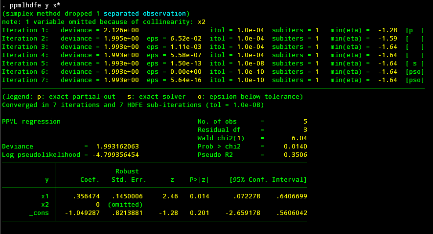
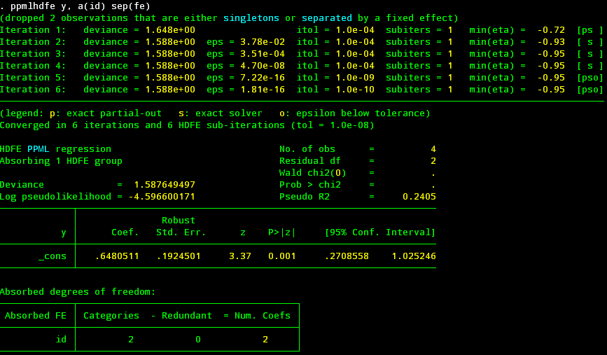
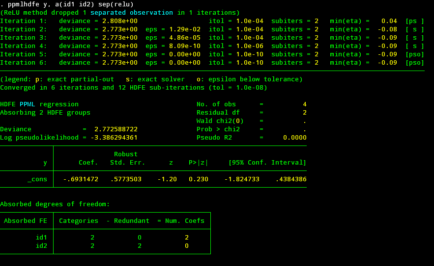
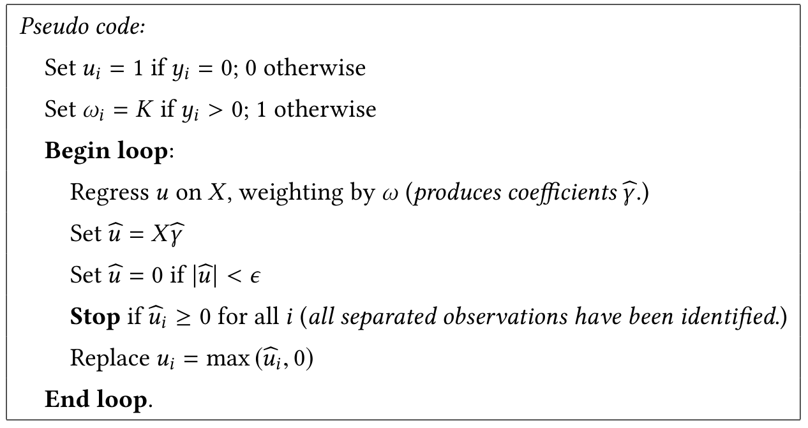
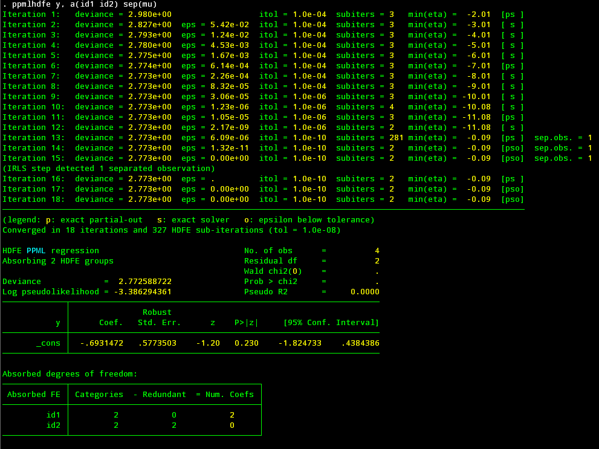
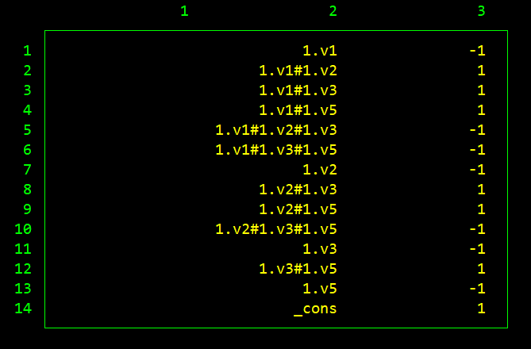

# Primer on statistical separation in Poisson models

- Jump to: [Readme](https://github.com/sergiocorreia/ppmlhdfe/blob/master/Readme.md) | [`ppmlhdfe` Paper](http://scorreia.com/research/ppmlhdfe.pdf) | [Separation Paper](http://scorreia.com/research/separation.pdf) | [Help File](http://scorreia.com/help/ppmlhdfe.html) | [Separation Primer](https://github.com/sergiocorreia/ppmlhdfe/blob/master/guides/separation_primer.md) | [Separation Benchmarks](https://github.com/sergiocorreia/ppmlhdfe/blob/master/guides/separation_benchmarks.md) | [Undocumented Options](https://github.com/sergiocorreia/ppmlhdfe/blob/master/guides/undocumented.md)
- Sections: [Why?](#why-might-ml-estimates-not-exist) | [When?](#when-does-this-issue-occur) | [Solutions](#how-does-ppmlhdfe-actually-finds-the-separated-observations) | [∞](#to-infinity-and-beyond)

*(This guide is an abridged version of [Verifying the existence of maximum likelihood estimates for generalized linear models](http://scorreia.com/research/ppmlhdfe.pdf); please see the paper for a more detailed explanation)*

As noted in Santos Silva and Tenreyo ([2010](https://www.sciencedirect.com/science/article/pii/S0165176510000832), [2011](https://www.stata-journal.com/article.html?article=st0225)), maximum likelihood estimates of Poisson models might not exist, due to the problem known as "statistical separation". In practice, this is seen in regression estimates that do not converge, or even worst, converge to incorrect estimates.

## Why might ML estimates not exist?

The log-likelihood function of Poisson models is `log L = Σ[-exp(Xb) + (Xb) y - log(y!)]`. If we denote the residuals as `e = y-exp(Xb)`, then its first order condition is `X'e=0` (same as with least squares, but with a different definition of residuals).

Now suppose we have a regressor `x` that is always zero when `y>0`, and non-negative when `y=0`. For instance, this simple dataset:

| y | x |
|---|---|
| 0 | 1 |
| 0 | 1 |
| 0 | 0 |
| 1 | 0 |
| 2 | 0 |
| 3 | 0 |

**Question: what value of `b` minimizes the residuals `e = y-exp(a+xb)`?**

Note that the value of `b` can only affect the residuals of the first two observations (because `x=0` elsewhere). Moreover, you can actually set `e=0` for these first two observations if you set `b=-∞` (minus infinity)!

In terms of the log likelihood, it is straightforward to verify that the log-likelihood contributions of the first two observations take their maximum possible value when `b=-∞`: `LL_i = -exp(-∞) + (-∞)(0) - 0 = 0`.

Since -∞ is not part of the real values (only of the [extended reals](https://en.wikipedia.org/wiki/Extended_real_number_line)), this means that maximum likelihood estimates will not exist. Moreover, trying to [estimate this in any modern statistical package](separation_benchmark.md) (Stata, R, Python, Julia, etc) can result in all kinds of issues. For instance, Stata's `poisson` command does converge, but to an arbitrary low negative sign (-18.8 in this case):

```stata
clear
set obs 6
gen y = max(_n - 3, 0)
gen x = _n < 3
poisson y x
```

<p align="center"></p>

*(Trivia: since `mean(y)=1.5` for observations 3-6, the estimate for the constant is `log(1.5)=0.405`)*

## When does this issue occur?

As explained in the paper, separation occurs when we can find a linear combination of the regressors "z" (`z = Xγ`)such that:

1. z=0 if y>0
2. z≥0 if y=0, with at least one strict inequality

If you can find a z where this occurs, then the observations where `z>0` are *separated* and there will be at least one estimate with infinite values that makes these observations have a perfect fit.

Moreover, `z` acts a a "certificate of separation", because we can regress it through least-squares against the regressors `X`, and if we observe a perfect fit (R2=1.0), then we can verify that the `z>0` observations are indeed separated.

Notice also that this is a significantly stronger result than the one shown in  Santos Silva and Tenreyo (2010), where only condition #1 is presented. Indeed, by combining these two conditions, we actually arrive at a "sharp criterion" for detecting separation.

*(Note: it is equivalent to state condition #2 in terms of z≥0 or z≤0 inequalities)*

The example below shows one example involving two regressors:

| y | x1 | x2  |
|---|----|-----|
| 0 | 2  | -1  |
| 0 | -1 | 2   |
| 0 | 0  | 0   |
| 1 | 0  | 0   |
| 2 | 5  | -10 |
| 3 | 6  | -12 |

Here, neither x1 nor x2 are equal to zero when y>0, but we can create a combination `z = 2 x1 + x2` that will satisfy both conditions:

| y | x1 | x2  | z |
|---|----|-----|---|
| 0 | 2  | -1  | 3 |
| 0 | -1 | 2   | 0 |
| 0 | 0  | 0   | 0 |
| 1 | 0  | 0   | 0 |
| 2 | 5  | -10 | 0 |
| 3 | 6  | -12 | 0 |

Thus, the first observation is separated.

Now, even this simple example will be difficult for standard statistical packages. For instance, the code below creates the data in Stata and runs the `poisson` command:

```stata
* Create data
clear
set obs 6
gen y = max(0, _n-3)
gen x1 = 2*(_n==1) - (_n==2) + cond(_n>4, _n, 0)
gen x2 = 2 * (_n==2) - 2 * cond(_n>4, _n, 0) - (_n==1)
* Try to run -poisson-
poisson y x1 x2
```

(If you can, run it own your own and see what happens)

However, note that `ppmlhdfe` does detect and drop the separated observation. Moreover, note that by dropping the observation, the separation issue gets reduced to a collinearity problem, which in standard Stata fashion is solved by dropping one of the two collinear regressors (as in the case of perfect collinearity, this is something that you might not want to do, as it is often better to understand if there are any issues with the underlying specification):

<p align="center"></p>

Even further, you can use `ppmlhdfe` to discover the exact linear combination of variables that causes the separation problem (i.e., the `z`). The command below thus generates an indicator variable `sep` listing the separated observations, and creates a certificate of separation `z`, which is then regressed against the Xs to verify that R2=1.0 and the first observation is indeed separated:

```stata
ppmlhdfe y x*, tagsep(sep) zvar(z) r2
```

<p align="center"></p>

Now that we have seen how this issue arise, we will briefly discuss how `ppmlhdfe` actually detects separated observations. Also, note that the separation problem is *particularly pernicious* in specifications with many fixed effects (because there are many more possible linear combinations that can lead to separation), so a lot of the extra care is to ensure that all separated observations are detected.


## How does `ppmlhdfe` actually finds the separated observations?

By default, `ppmlhdfe` uses four methods to identify separated observations. However, after reading the discussion below and seeing their pros and cons, you can choose to only including some of the methods, thus slightly increasing the speed of the command.


### `ppmlhdfe, separation(fe)`

You can easily find some separated observations if you find categories of the fixed effects that only exist when y=0. For instance, if we have a regression with individual fixed effects, then the individuals that have always had y=0 will have their observations separated, because the indicator variables underlying their fixed effect already satisfy the requirements to be a certificate of separation `z`.

You can see the method in practice in the example below:

| y | id |
|---|----|
| 0 | 1  |
| 0 | 1  |
| 0 | 2  |
| 1 | 2  |
| 2 | 3  |
| 3 | 3  |

Here, notice how the observations for the first individual (in the first two obs.) are separated. In Stata:


```stata
clear
set obs 6
gen y = max(0, _n - 3)
gen id = ceil(_n / 2)
li, sepby(id)

ppmlhdfe y, a(id) sep(fe)
```

<p align="center"></p>

As you can see in the line `(dropped 2 observations ...)`, the separated observations were indeed dropped.


### `ppmlhdfe, separation(simplex)`

This method implements the modified simplex solver described by Clarkson and Jennrich (1991), with some twists. For instance, there is no need to run the simplex if there are no perfectly collinear regressors on the y>0 sample, in which case we stop.

This method would be sufficient except for one large drawback, that it does not handle separation arising from fixed effects, or from linear combinations of fixed effects and other regressors.

For instance, in the example below, the combination of the `fe` and `simplex` methods fails to detect separation:

```stata
clear
input byte(y id1 id2)
0 1 1
1 1 1
0 2 1
0 2 2
1 2 2
end

ppmlhdfe y, a(id1 id2) sep(fe simplex)
```

That said, if you are not using fixed effects, then `sep(simplex)` should be enough.

### `ppmlhdfe, separation(ir)`

*(Also known as `ppmlhdfe, separation(relu)`)*

This is the method described by [Correia, Guimarães, Zylkin](http://scorreia.com/research/separation.pdf). It is easy to code and more general than the simplex method, but this comes at the cost of some speed.

To understand this method, we will first use it to solve the example above, and then actually implement it *by hand*.

```stata
clear
input byte(y id1 id2)
0 1 1
1 1 1
0 2 1
0 2 2
1 2 2
end

ppmlhdfe y, a(id1 id2) sep(relu)
```

<p align="center"></p>

Now, if we were to implement the algorithm by hand, we could do so in less than 20 lines of standard Stata code (!):

```stata
* Create data
clear
input byte(y id1 id2)
0 1 1
1 1 1
0 2 1
0 2 2
1 2 2
end

* Run IR (iterative rectifier) algorithm
loc tol = 1e-5
gen u =  !y
su u, mean
loc K = ceil(r(sum) / `tol' ^ 2)
gen w = cond(y, `K', 1) 

while 1 {
	qui reghdfe u [fw=w], absorb(id1 id2) resid(e)
	predict double xb, xbd
	qui replace xb = 0 if abs(xb) < `tol'

	* Stop once all predicted values become non-negative
	qui cou if xb < 0
	if !r(N) {
		continue, break
	}

	replace u = max(xb, 0)
	drop xb w
}

rename xb z
gen is_sep = z > 0
list y id1 id2 is_sep
```

The [separation paper](http://scorreia.com/research/separation.pdf) contains a detailed description and proof of the method, but there are only a few steps involved:

<p align="center"></p>

A few notes:

- We can choose the weights `K` equal to `N0 / ϵ²` (where `N0` is the number of observations where `y=0`)
- Running a regression with very high weights when `y>0` just ensures that on those observations `Xb=0` within some tolerance. This is known as the ["method of weigthing"](https://link.springer.com/article/10.1007/BF02510363).
- The update `u = max(u, 0)` is known as a rectifier ([ReLU](https://en.wikipedia.org/wiki/Rectifier_(neural_networks))) in computer science and machine learning, and is the key trick that makes the algorithm work.
- Note that by combining the method of weighting with the rectifier, we ensure that `Xb` can be used as a valid [certificate of separation](#when-does-this-issue-occur) `z`, once we achieve convergence.


### `ppmlhdfe, separation(mu)`

This method, first mentioned by Clarkson and Jennrich (1991), does a simple heuristic to detect separated observations. If at any given point there are observations with `y=0` where the predicted values `μ=exp(xb)` are also very close to zero, then it is likely that these observations are indeed separated.

However, "very close to zero" is an arbitrary number, and thus a) if set too high then it might lead to false positives, and b) if set too low it might fail to detect some separated observations. Further, if there are separated observations then the IRLS iteration used by `ppmlhdfe` might converge extremely slowly, so it is not ideal to exclusively rely on this method.

Thus, we agree with Clarkson and Jennrich in that this method is not very useful on its own. That said, if combined with a conservative tolerance (which we do), it can be useful as a back-stop method. Checking if μ is taking very low values has almost no speed cost and is trivial to implement, and thus it can be used to complement the existing methods.

Using the previous example, here we can see `sep(mu)` in action:

```stata
clear
input byte(y id1 id2)
0 1 1
1 1 1
0 2 1
0 2 2
1 2 2
end

ppmlhdfe y, a(id1 id2) sep(mu)
```

<p align="center"></p>

The iteration takes a while to run (18 iterations, compared to 6 for the ReLU method), but the the separated observation is indeed detected, in iteration 15.

However, this method is fragile, specially when the dependent variable has a skewed distribution. In the example below, we we add three observations to the dataset, so the third observation is no longer separated. As a consequence, the `sep(mu)` method now converges extremely slowly (in 115 iterations), *and* to the wrong solution (incorrectly dropping one observation that is not separated):

```stata
clear
input double(y id1 id2)
0 1 1
1 1 1
0 2 1
0 2 2
1 2 2
1e-6 2 1
1e-6 2 1
1e-6 2 1
end

ppmlhdfe y, a(id1 id2) sep(mu) // takes a while to converge, and erroneously drops one obs.
ppmlhdfe y, a(id1 id2)  sep(relu) // converges quickly and to the correct number of observations
```

### Recap

The table below summarizes our views on the pros and cons of each method.

| Method  | Pro     | Con                                                                  |
|---------|---------|----------------------------------------------------------------------|
| fe      | Simple  | Only detects separation from a single category                       |
| simplex | Robust  | Does not work for fixed effects                                      |
| relu    | General | Slower, as each iteration involves computing weighted least squares  |
| mu      | Fast    | Works poorly with skewed data                                        |

For simple regressions without any fixed effects, the `sep(simplex)` method is a good choice, while for more complex regressions with many levels of fixed effects `sep(fe relu)` or `sep(fe simplex relu)` should work well. Optionally, the `mu` method can be added as a back-stop, and the user should also inspect the iteration log to see if there are very low values of mu.


## "To Infinity and Beyond!"

Given that the ML estimates are actually infinite, one may ask what are we reporting exactly, given that there are no infinite symbols in the regression tables. For this, let's revisit an earlier example:

| y | x1 | x2  | z |
|---|----|-----|---|
| 0 | 2  | -1  | 3 |
| 0 | -1 | 2   | 0 |
| 0 | 0  | 0   | 0 |
| 1 | 0  | 0   | 0 |
| 2 | 5  | -10 | 0 |
| 3 | 6  | -12 | 0 |

```stata
* Create data
clear
set obs 6
gen y = max(0, _n-3)
gen x1 = 2*(_n==1) - (_n==2) + cond(_n>4, _n, 0)
gen x2 = 2 * (_n==2) - 2 * cond(_n>4, _n, 0) - (_n==1)

ppmlhdfe y x1 x2
```

Here, `ppmlhdfe` drops x2 and returns `b1 = 0.35`. This is, however, not entirely accurate. If we allow ourselves to think in terms of infinities, as [Geyer (2009)](https://arxiv.org/abs/0901.0455) does, we can argue that the true estimates are `b1 = lim 2c + 0.35` and `b2 = lim c`, as `c` goes to infinity. This is described by Geyer in terms of a "direction of recession" in a Barndorff-Nielsen completion, as otherwise one would just say that `b1 = b2 = ∞`. 

This also raises the question of how the `b1 = 0.35` reported by ppmlhdfe should be interpreted. As we discuss in the paper, it is useful to think of the issue as being similar to (though not exactly the same as) a perfect collinearity problem. That is, the reported "`b1`" is really an estimate for the combined parameter `b1-2*b2`, similar to how one would interpret estimates in models with omitted perfectly collinear regressors. Furthermore, we show in the paper that this is a consistent estimate for `b1-2*b2` (and that any regressors *not* involved in separation - in this case, the constant - are consistently estimated as well.)

Another way of framing the problem would be to add a third variable to the regression, `z = 2 x1 + x2`. Then, we can do:

```stata
ppmlhdfe y z x1 x2
```

Here, the only estimate with "infinities" would be the one for `z`. However, it is a matter of interpretation whether you can add such a `z` variable.

If you don't know exactly the linear combination of regressors that produces `z`, you can also use `ppmlhdfe` to obtain it. For instance, below we reproduce Table 1, Example 2.3 of Geyer (2009):

```stata
import delimited using "http://www.stat.umn.edu/geyer/gdor/catrec.txt", delim(" ") clear
ppmlhdfe y i.(v*)#i.(v*)#i.(v*) , tagsep(sep) zvar(z) r2 // Get certificate of separation Z, and regress it against the Xs
* Code below is just to present a prettier output:
matrix b = e(b)
mata: vars = st_matrixcolstripe("b")
mata: directions = round(st_matrix("b"), 0.001)'
mata: idx = selectindex(directions)
mata: (vars, strofreal(directions))[idx, .]
```

<p align="center"></p>

As we can see, we are able to recover Geyer's "direction of recession" by employing the ReLU algorithm, which has the added advantage of being easy to implement, and not requiring exact algebra routines.
