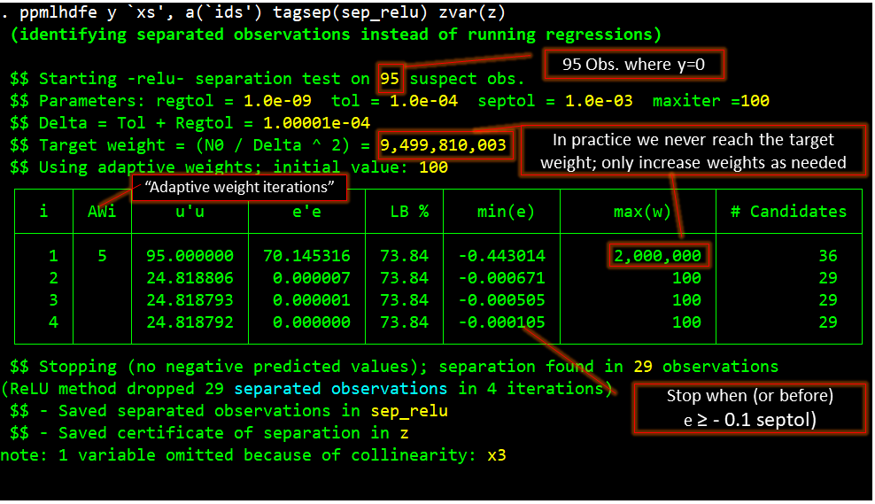
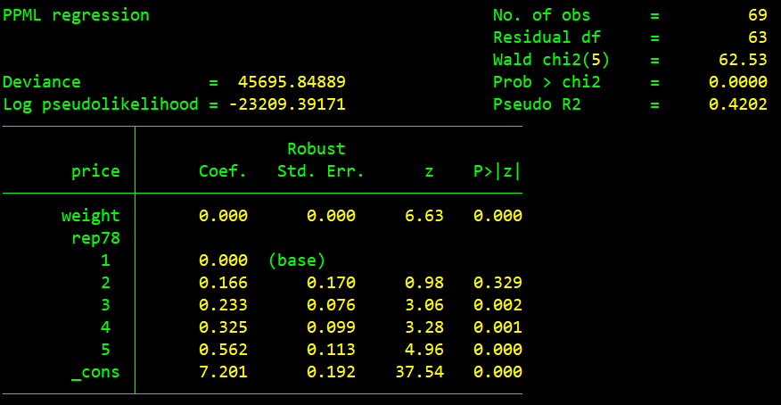
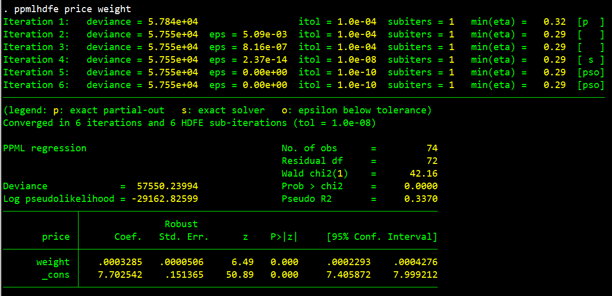
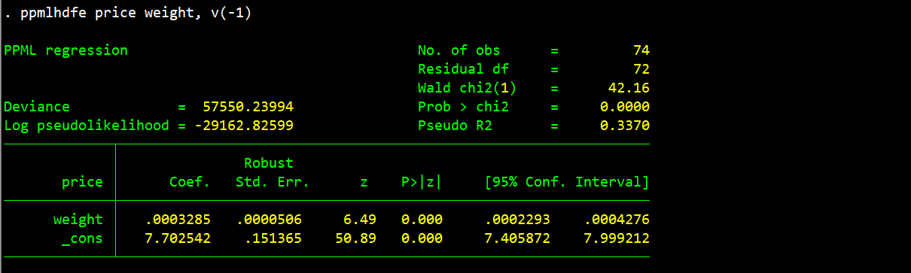
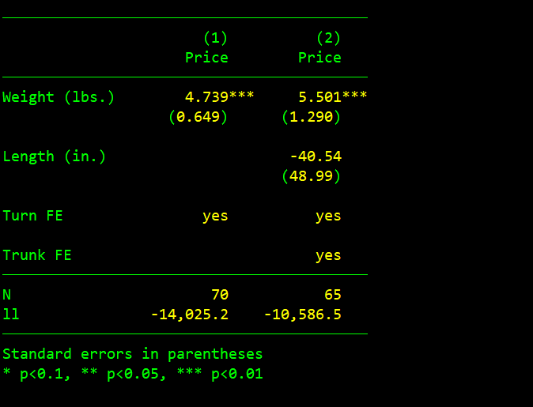
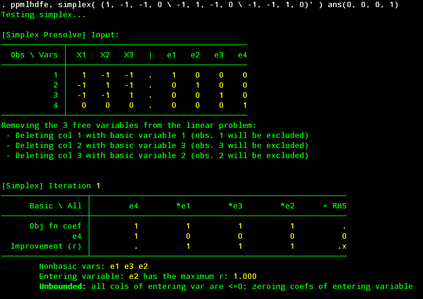

# Undocumented options of ppmlhdfe

- Jump to: [Readme](https://github.com/sergiocorreia/ppmlhdfe/blob/master/Readme.md) | [`ppmlhdfe` Paper](http://scorreia.com/research/ppmlhdfe.pdf) | [Separation Paper](http://scorreia.com/research/separation.pdf) | [Help File](http://scorreia.com/help/ppmlhdfe.html) | [Separation Primer](https://github.com/sergiocorreia/ppmlhdfe/blob/master/guides/separation_primer.md) | [Separation Benchmarks](https://github.com/sergiocorreia/ppmlhdfe/blob/master/guides/separation_benchmarks.md) | [Undocumented Options](https://github.com/sergiocorreia/ppmlhdfe/blob/master/guides/undocumented.md)
- Sections: [reghdfe internals](#options-related-to-reghdfe-internals) | [Mata internals](#mata-internal-options) ([Initialization](#initialization-options) - [IRLS](#irls-options) - [Simplex](#simplex-separation-options) - [ReLU](#irrelu-separation-options) - [Mu](#mu-separation-options)) | [Display](#misc-display-options) | [Margins and esttab](#esttab-and-margins-options)

This guide describes advanced and internal `ppmlhdfe` options.

## Options related to reghdfe internals

- (Recall that `tolerance(1e-8)` is the tolerance used to determine convergence within the IRLS step, not within reghdfe)
- `itol(1e-9)`: reghdfe tolerance, used in three situations:
	1. When running collinearity tests.
	2. Within the `guess(ols)` option
	3. Within the IRLS step. Here it will be the "desired" reghdfe tolerance, and will differ from the actual reghdfe tolerance for two reasons:
		1. For speed purposes, the initial IRLS tolerance depends on the `start_inner_tol(1e-4)`
		2. To ensure convergence and avoid numerical precision issues, the final reghdfe tolerance needs to be at least `0.1 irls_tolerance` and at most `1e-12`.
- `accel(str)` denotes the type of acceleration used when partialling out, and is only relevant with 2 or more sets of fixed effects. Valid options are `cg` (conjugate gradient, default), `sd` (steep descent), `a` (Aitken), [`lmsr`](http://web.stanford.edu/group/SOL/software/lsmr/), and `none`.
- `transf(str)` denotes the type of alternating projection used, and is only relevant with 2 or more sets of fixed effects. valid options are `sym` (symmetric Kaczmarz, default), `kac` (Kaczmarz), and `cim` (Cimmino). This option is unused with `lsmr` accelerations.


## Mata internal options

`ppmlhdfe` allows you to change *any* of the internal options defined in the [GLM](https://github.com/sergiocorreia/ppmlhdfe/blob/master/src/ppmlhdfe.mata#L108) Mata class.
For instance, if you don't want to standardize the variables before running the computations you can add the `standardize_data(1)` option to ppmlhdfe:

```stata
sysuse auto
ppmlhdfe price gear, a(turn trunk) standardize_data(0)
```

In this case, notice how turning off standardization gives the exact same results although convergence takes a little longer (see [Marquardt (1980)](https://www.jstor.org/stable/pdf/2287388.pdf) for a discussion of the numerical benefits of standardizing or "scaling" the data).

Also note that all of these Mata options must be set in the form `option(value)` (so you cannot write `standardize_data` but must write `standardize_data(0)` or `standardize_data(1)`).


### Initialization options

- `remove_collinear_variables(1)`: whether to initially check for collinear variables. Setting it to zero saves a `reghdfe` regression, but might make detecting separation a bit more difficult
- `standardize_data(1)`: whether to standardize each variable (divide it by its standard deviation). Doing so improves the numerical stability of the computations, at a small speed cost.

### IRLS options

- `tolerance(1e-8)`: We achieve convergence once `epsilon < tolerance`, where `epsilon = ΔDeviance / Deviance` (with some nuances for corner cases). Thus, a `tolerance` closer to zero leads to slower but more accurate results, while higher `tolerance` can be used for quick-and-dirty regressions.
- `use_exact_solver(0)`: whether to always use an exact least-squares solver (instead of accelerating when `itol` is within 10 of `tolerance`).
- `use_exact_partial(0)`: every IRLS iteration partials out (z, X) instead of the equivalent-but-faster alternatives (described in the paper).
- `target_inner_tol(1e-9)`: you can actually set this directly with the `itol()` option; see above.
- `start_inner_tol(1e-4)`: initial tolerance when partialling-out.
- `min_ok(1)`: by default we only stop when we observe `epsilon < tolerance` two times. Using `min_ok(2)` or higher forces a few extra iterations. This is useful in corner cases where the deviance has converged but the rightmost digits of the estimates might still be converging.
- `maxiter(1000)`: maximum number of iterations, after which an error is raised.
- `use_heuristic_tol(1)`: when this option is on, we try to anticipate if the next iteration is likely to converge. If that's the case, we preemptively increase the inner tolerance and use an exact solver, so we can stop there.

### Simplex separation options

- `simplex_tol(1e-12)`: internal tolerance used within simplex step. In particular, this is used to round to zero variables that are within `simplex_tol` of zero.
- `simplex_maxiter(1000)`: maximum number of iterations used within simplex step.

### IR/ReLU separation options

- `relu_tol(1e-4)`: used to set internal tolerances. For instance, calls to reghdfe will be set with tolerance equal to `relu_tol/10`.
- `relu_maxiter(100)`: maximum number of iterations in ReLU step. If exceeded, the step will stop but an error will not be raised
- `relu_strict(0)`: if set to 1, will raise an error if `relu_maxiter` is exceeded.
- `relu_accelerate(0)`: if set to 1, it will slightly increase the weights of observations that are persistently negative, usually leading to faster convergence. This has been disabled by default as it tends to slowdown the other acceleration trick used (explained in the paper; see the line `utilde = u + utilde - u_last`).

#### Creating certificates of separation

A "certificate of separation" is a variable z that can be used to certify that some observations are separated, and what regressors are causing the separation. To do so, it must satisfy two properties: a) `z≥0`, and b) a least-squares regression between `z` and all regressors should have an R2 of 1.

There are three undocumented options that allow you to construct and use a certificate of separation. Example:

```stata
set obs 10
gen y = _n * (_n>4)
gen x = 2 * (_n==1) + 1 * (_n==2)
ppmlhdfe y x, tagsep(separated) zvar(z) r2
list
```

- `tagsep(..)`: saves an indicator variable representing the observations identified as separated by the ReLU step.
- `zvarname(..)`: saves the certificate of separation.
- `r2`: use it to run a least-squares regression between the certificate of separation `z` and all regressors.

#### Explanation of the ReLU debugging output

If you run `ppmlhdfe` with the `tagsep()` option as described above, or with `verbose(1)` or higher, you will see a table describing each iteration of the ReLU algorithm:

<p align="center"></p>


### Mu separation options

- `mu_tol(1e-6)`: criteria for when to tag an observation as separated. This will happen for all observations where `y=0` and `μ<mu_tol`. Note that `μ=1e-8` corresponds to `η=-13.82`.
- Because some datasets are very skewed and have very low (but positive) y values, we do an extra adjustment. If `min(η | y > 0)` is below -5, we will make the tolerance more conservative by that amount. For instance, if `min(η | y > 0) = - 8`, then we will have `log(mu_tol) = log(1e-6) + (-8 - -5) = log(1e-6) - 3 = -16.82`.


## Misc. display options

You can use several [estimation options](https://www.stata.com/help.cgi?estimation+options) to customize the regression output. For instance:

```
sysuse auto, clear
gen w = weight
ppmlhdfe price weight w i.rep, level(90) cformat(%6.3fc) noci baselevels noomitted vsquish
```

Produces:

<p align="center"></p>


### Disabling iteration output

You can also display the iteration output, as well as warning messages, by using the verbose(-1) option. You go from:

<p align="center"></p>

To:

<p align="center"></p>


## `esttab` and `margins` options

To produce journal-style regression tables, you can do:

```stata
cls
estimates clear 
sysuse auto, clear
 
qui ppmlhdfe price weight, a(turn) d
qui estpost margins, dydx(_all)
qui eststo
 
qui ppmlhdfe price weight length, a(turn trunk) d
qui estpost margins, dydx(_all)
qui eststo
 
estfe *, labels(turn "Turn FE" trunk "Trunk FE")
esttab, indicate(`r(indicate_fe)', labels("yes" "")) stat(N ll, fmt(%9.0fc %10.1fc)) se starlevels(* 0.1 ** 0.05 *** 0.01) label compress
```

Output:

<p align="center"></p>

For more information, see the [`ppmlhdfe` article](http://scorreia.com/research/ppmlhdfe.pdf), as well as the [esttab](http://repec.org/bocode/e/estout/hlp_esttab.html) and [margins](https://www.stata.com/features/overview/marginal-analysis/) manuals.


# Options used in testing

## Simplex method

`ppmlhdfe` has a simplex option that allows us to directly call the Simplex solver, and even verify that it gave the correct answer. For instance, in the example below we will pass a matrix of four observations and three regressors.

Note that `X1 + X2 + X3 = (-1, -1, -1, 0)`, so observations 1, 2, and 3 are separated.

```stata
ppmlhdfe, simplex( (1, -1, -1, 0 \ -1, 1, -1, 0 \ -1, -1, 1, 0)' ) ans(0, 0, 0, 1)
```

Partial output:

<p align="center"></p>
